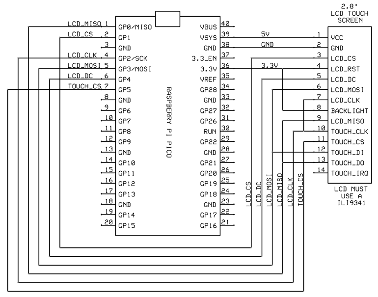
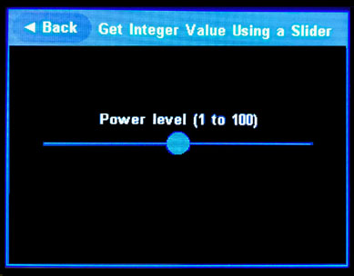
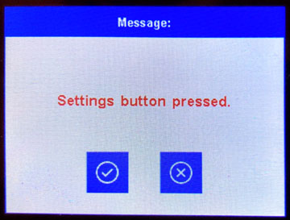

# Touch User Interface For Arduino:

This library is a simple user interface for building Arduino applications.  It requires an Arduino with a 32bit processor such as a  *Raspberry Pi Pico* or *ESP32*.  The user interface centers around building apps with one or more touchscreen menus.  There are also many features for creating your own screens to present your own data or prompt the user for information.


Documentation and code for the *TouchUserInterfaceForArduino* Interface library can be found at:

​     https://github.com/Stan-Reifel/TouchUserInterfaceForArduino


### Hardware:

This library has only been tested with a *Raspberry Pi Pico* (compiled with the Arduino IDE using *Earle F Philhower's Arduino core*) but will likely work with many other Arduinos having 3.3 volt, 32 bit processors.  

This user interface requires a 2.8" 320x240 ILI9341 LCD touch screen display.  These displays are very inexpensive and easy to hookup.  


These Touchscreen LCDs can be purchased online from many sources, including:

- Amazon:  Search for:  "HiLetgo ILI9341 2.8" TFT LCD Display"

- eBay:  Search for:  "ILI9341 2.8" TFT LCD Display"

- PJRC  www.pjrc.com/store/display_ili9341_touch.html

  

Here's how to wire the LCD to the Arduino:

|              Arduino              |      Display       |
| :-------------------------------: | :----------------: |
|                +5V                |  Pin 1 - LCD VCC   |
|                GND                |  Pin 2 - LCD GND   |
|  LCD_CS_PIN (use any output pin)  |   Pin 3 - LCD CS   |
|               3.3V                | Pin 4 - LCD RESET  |
|  LCD_DC_PIN (use any output pin)  |   Pin 5 - LCD DC   |
|               MOSI                |  Pin 6 - LCD SDI   |
|                SCK                |  Pin 7 - LCD CLK   |
|               3.3V                |  Pin 8 - LCD LED   |
|               MISO                |  Pin 9 - LCD SDO   |
|                SCK                | Pin 10 - TOUCH CLK |
| TOUCH_CS_PIN (use any output pin) | Pin 11 - TOUCH CS  |
|               MOSI                | Pin 12 - TOUCH DIN |
|               MISO                | Pin 13 - TOUCH DO  |

Any of the processor's digital output pins can be chosen for *LCD_CS_PIN*, *LCD_DC_PIN* and *TOUCH_CS_PIN*, just be sure to update those constants in your program to reflect the pin numbers selected.


When using a *Raspberry Pi Pico* (with *Earle F Philhower Arduino core*), the SPI pin numbers must be assigned.  Here's example code for setting up the *Raspberry Pi Pico* to use the SPI Port with GP0, GP2, GP3:

​    SPI.setTX(3);       // assign the SPI MOSI pin
    SPI.setRX(0);       // assign the SPI MISO pin
    SPI.setSCK(2);     // assign the SPI SCK pin

These lines must be executed before calling *ui.begin()*.  Note:  A small number of SPI pin combinations are possible.  Check the Earle's documentation to learn more.

Here is how to wire the LCD to a Raspberry Pi Pico:


### Libraries:

Install the *TouchUserInterfaceForArduino* library as follows:

1. ​    Go to: https://github.com/Stan-Reifel/TouchUserInterfaceForArduino

2. ​    Pull down the green *Code* button, then click *Download ZIP* and *Save*.
3. ​    In the Arduino IDE, select: Sketch / Include Library / Add ZIP Library
4. ​    In the *Select ZIP file* dialog box, choose the .ZIP file just downloaded, then click *Open*


The *TouchUserInterfaceForArduino* library uses three other libraries which must be installed:
    Adafruit_ILI9341               - Driver for the LCD screen
    Adafruit_GFX_Library       - Driver for the LCD screen
    XPT2046_Touchscreen     - Driver for the touch screen

Note 1:  The *Adafruit_ILI934*, *Adafruit_GFX_Library* and *XPT2046_Touchscreen* can be installed directly from *Arduino's Library Manager*.  When looking for *XPT2046_Touchscreen*, scroll down in the Library Manager to find the *XPT2046_Touchscreen* by *Paul Stoffregen.*

Note2:  For *Raspberry Pi Pico* users: There are versions of the Adafruit_GFX_Library and Adafruit_ILI9341 drivers that have been optimized for the Pi Pico, giving about a 2X improvement in LCD speed.  These libraries have the same names and are drop-in replacements.  They are recommended for Pico users.  Find them here:
      https://github.com/Bodmer/Adafruit-GFX-Library
      https://github.com/Bodmer/Adafruit_ILI9341
(These optimized libraries don't use the Pi Pico's PIOs, so they remain available)


# Software Notes:

### Overview:

The display of the *TouchUserInterfaceForArduino* is divided into two sections:  Along the top is a *Title Bar* and below is the *Display Space*.  The Display Space is where menus, message boxes, configuration screens, along with the application's main display are shown.

The heart of this user interface are menus.  Menus are displayed in rows and columns of touch sensitive buttons.  These  menu buttons are automatically sized to fill the screen.  There are three types of menu buttons: *Commands*, *Toggles* and *Sub Menus*.  Menus are displayed by creating a *Menu Table* in your source code, then calling:   *ui.displayAndExecuteMenu()*


### Getting started:

It is assumed that you have already configured the Arduino IDE to work with your Arduino board.  If using a *Raspberry Pi Pico*, then *Earle F Philhower's Arduino core* must be installed and selected in the *Tools / Boards* menu.  Also be sure to installed the three other libraries as described above.


Near the top your sketch, add this code:

```
#include <Arduino.h>
#include <SPI.h>
#include <TouchUserInterfaceForArduino.h>
#include <UI_Fonts.h>

TouchUserInterfaceForArduino ui;

const int LCD_CS_PIN     = 1;     // configure these values to match your hardware
const int LCD_DC_PIN     = 4;
const int TOUCH_CS_PIN   = 5;
const int SPI_MOSI_PIN   = 3;
const int SPI_MISO_PIN   = 0;
const int SPI_SCK_PIN    = 2; 
```


Inside your *setup()* function, add this to initialize the *TouchUserInterfaceForArduino*:

```
ui.begin(LCD_CS_PIN, LCD_DC_PIN, TOUCH_CS_PIN, LCD_ORIENTATION_LANDSCAPE_4PIN_LEFT, UI_Font_13_Bold);
```


If you are using a *Raspberry Pi Pico*, do this instead in your *setup()* function.  The Pico requires extra code before calling *ui.begin()* to setup the SPI port :

```
SPI.setTX(SPI_MOSI_PIN);
SPI.setRX(SPI_MISO_PIN);
SPI.setSCK(SPI_SCK_PIN);

ui.begin(LCD_CS_PIN, LCD_DC_PIN, TOUCH_CS_PIN, LCD_ORIENTATION_LANDSCAPE_4PIN_LEFT, UI_Font_13_Bold);
```

Note: In the *.begin()* function you are also setting the screen's orientation.  Choose between:
                       LCD_ORIENTATION_PORTRAIT_4PIN_TOP 
                       LCD_ORIENTATION_LANDSCAPE_4PIN_LEFT
                       LCD_ORIENTATION_PORTRAIT_4PIN_BOTTOM 
                       LCD_ORIENTATION_LANDSCAPE_4PIN_RIGHT


### Creating the main menu:

Just below the *setup()* function you will define your *Main Menu*.  A typical main menu table might look like:

```
//
// forward declarations for each menus
//
extern MENU_ITEM mainMenu[];
extern MENU_ITEM settingsMenu[];	  // add this line if you have a Settings submenu

//
// the main menu table
//
MENU_ITEM mainMenu[] = {
{MENU_ITEM_TYPE_MAIN_MENU_HEADER, "My App",   MENU_COLUMNS_1,          mainMenu},
{MENU_ITEM_TYPE_COMMAND,          "Log data", menuCommandLogData,      NULL},
{MENU_ITEM_TYPE_TOGGLE,           "Sound",    menuToggleSoundCallback, NULL},
{MENU_ITEM_TYPE_SUB_MENU,         "Settings", NULL,                    settingsMenu},
{MENU_ITEM_TYPE_END_OF_MENU,      "",         NULL,                    NULL}
};
```


The first line in a menu table sets what type of menu it is, either a *Main Menu*, or a *Sub Menu*.  Since we are building the main menu, the first column of this entry is set to: *MENU_ITEM_TYPE_MAIN_MENU_HEADER*.  The three other columns in this line define more about the menu.  The second field contains text printed on the LCD's Title Bar when the menu is displayed.  The next column sets how the buttons are arranged on the screen and is usually set to *MENU_COLUMNS_1* or *MENU_COLUMNS_2*.  The fourth field is usually set to the name of the main menu, referring to itself.   i.e. *mainMenu*.


Now you will add one line to the table for each button that you want displayed in the menu.  There are three different types of buttons that can be added:

Commands:  A *MENU_ITEM_TYPE_COMMAND* entry indicates that a function (written by you) will be executed when this menu button is pushed by the user. In the second column you place the text that you want displayed on the button.  The third column is the name of the function that is executed when the menu button is clicked.  The last column should always be *NULL*.

Toggles:  A *MENU_ITEM_TYPE_TOGGLE* is used somewhat like a Radio Button in a dialog box.  Toggles let the user choose one of a fixed number of choices (such as *On* / *Off*,  or  *Red* / *Green* / *Blue*).  Each time the user clicks on a toggle button, it alternates the selection.  In the second column is the button's text.  The third column is the name of a callback function that you write to alternates the value. The last column should always be *NULL*.

Sub menus:  A *MENU_ITEM_TYPE_SUB_MENU* entry is used to select a different menu.  Often it is useful to group related commands into their own menu, this is what *Sub menus* are for. For example, the main menu might reference a *Settings* sub menu which would be filled with commands for configuring your app.  In the second column of this entry is the text displayed on the button describing the sub menu.   The fourth field is the name of the sub menu table.


A menu can have as many buttons as you like, simply by adding more entries to the menu table.  Buttons are sized such that they always fill the screen, adding more causes them to be shorter in height.  In many cases it is advantageous to arrange a menu's buttons in two or more columns.  Columns of buttons often look better, are easier to touch, and you can fit more on a single screen.

The buttons on a menu can be arranged in 1, 2, 3 or 4 columns.  The number of columns is set in the third field of the menu table's first line by inserting one of these values:
             MENU_COLUMNS_1,  MENU_COLUMNS_2,  MENU_COLUMNS_3,  or  MENU_COLUMNS_4


The table's last line marks the menu's end with a *MENU_ITEM_TYPE_END_OF_MENU* entry.  The second column should always be "".  The third and fourth columns are sent to *Null*.


### Creating a sub menu:

Sub-menus are menus called from the main menu, or another sub menu.  Sub menus allow you to group related commands into their own menu. For example, a *Settings* sub menu might be filled with commands for configuring your app.  

Sub menus are built just like the Main menu, except that the first entry must be *MENU_ITEM_TYPE_SUB_MENU_HEADER*. In the first line's fourth column is the name of the parent menu (typically the main menu).  This is used to reselect the parent menu when the user presses the *Back* button, indicating they are done with the sub menu.

Here is a table for a typical sub menu:

```
//
// the Settings menu
//
MENU_ITEM settingsMenu[] = {
{MENU_ITEM_TYPE_SUB_MENU_HEADER, "Menu Name",    MENU_COLUMNS_2,         mainMenu},
{MENU_ITEM_TYPE_COMMAND,         "Set contrast", menuCommandSetContrast,  NULL},
{MENU_ITEM_TYPE_TOGGLE,          "Power mode",   menuTogglePowerCallback, NULL},
{MENU_ITEM_TYPE_TOGGLE,          "LED",          menuToggleLEDCallback,   NULL},
{MENU_ITEM_TYPE_END_OF_MENU,     "",             NULL,                    NULL}
};

```


### The Toggle call back function:

*Toggle* buttons in a menu let the user to select one of a fixed number of choices (such as *On* / *Off*,  or  *Red* / *Green* / *Blue*).  Each time the user clicks on a Toggle button, it alternates the selection (i.e. toggles between *On* and *Off*, or rotates between *Red*, *Green* and *Blue*). To accomplish this, the Toggle's menu entry includes the name of a callback function that you must write.  This function does several things:  1) Switches to the next state.  2) Optionally updates hardware to reflect the new state.  3) Sets the text displayed on the menu button for that state.  

Here's an example of how to write the callback function for a Toggle:

```
void menuToggleLEDCallback(void)
{
  //
  // check if menu is requesting state be changed (can have more than 2 states)
  //
  if (ui.toggleMenuChangeStateFlag)
  {
    ledState = !ledState;					// select the next state
  }
  
  //
  // turn the LED on or off as indicated by the state
  //
  if (ledState)
    digitalWrite(LED_PIN, HIGH);
  else
    digitalWrite(LED_PIN, LOW);
 
  //
  // send back text describing the current state
  //
  if(ledState)
    ui.toggleMenuStateText = "On";
  else
    ui.toggleMenuStateText = "Off";
}
```


### Showing your app first on power up, rather than a menu:

Most of the examples sketches included with this library display a menu when the sketch first runs.  In some cases you want to start with your application showing its own display, then let the user press a button to pull up the menu.  An example sketch of this type is *Example8_StopWatch* found in the *examples* folder.  

In this situation you will display your application when the sketch first runs.  Added to the LCD's *Title bar* is a *Menu* button.  At any time, the user can exit your display and bring up the menu by clicking on this button.  There are a few things that you must do to make this work:


1) In your application's main screen, you must first draw the *Title Bar* to include the *Menu* button.  Do so as follows:

```
  ui.drawTitleBarWithMenuButton("The Name Of Your App");
```


2) In your app's main loop, you must continuously check if the user has clicked the *Menu* button. 

```
while(true)
{
  ui.getTouchEvents();			              // get new touch events on the LCD
  if (ui.checkForMenuButtonClicked())         // check if Menu button was press
  {
       ui.displayAndExecuteMenu(mainMenu);    // user pressed "Menu", display it
       redrawYourApp();                       // after exiting menu, redraw app
  }
  // do other things that your app needs:  update the display, check IO...
}
```


3) When the menu is displayed, it needs to have a *Back* button.  This provides a way for the user to exit the menu and go back to your application.  Normally the Main Menu doesn't show the *Back* button on the *Title Bar*, so it must be enabled.  To do that, the fourth column in the first line of your menu table must be set to NULL (instead of *mainMenu*, which is typical).  Here's a menu table with the first line configured so the *Back* button is enabled:

```
MENU_ITEM mainMenu[] = {
  {MENU_ITEM_TYPE_MAIN_MENU_HEADER, "Stopwatch Settings",     MENU_COLUMNS_1,          NULL},
  {MENU_ITEM_TYPE_COMMAND,          "Set number of digits",   commandSetDigits,        NULL},
  {MENU_ITEM_TYPE_COMMAND,          "Set screen colors",      commandSetScreenColors,  NULL},
  {MENU_ITEM_TYPE_COMMAND,          "About",                  commandAbout,            NULL},
  {MENU_ITEM_TYPE_END_OF_MENU,      "",                       NULL,                    NULL}
};
```


### Building your own screens:

Often commands executed from a menu button need to display some information, or prompt the user to enter some information.  To do this you can build screens of your own design.  On these screens you can draw text and display graphics.  You can also place a few different widgets that are built into the *TouchUserInterfaceForArduino*.  These widgets are:  Buttons, Number Boxes, Sliders and Selection Boxes.

When you create a custom screen, you need a way for the user to exit that screen and return to the menu.  There are two methods for doing this.  The first is with a *Back* button on the *Title Bar*.  This code shows how to write a complete menu command that draws the *Title bar* to include the *Back* button, and checks if the user touches it:

```
void commandBackButtonExample(void)
{
  ui.drawTitleBarWithBackButton("Back Button Example");	 // include Back button
  ui.clearDisplaySpace();							     // clear the display
  
  												         // display some text
  ui.lcdSetCursorXY(ui.displaySpaceCenterX, ui.displaySpaceCenterY - 10);
  ui.lcdPrintCentered("We exit this screen with the Back button.");

  while(true)                            // wait for user to press "Back" button
  {
    ui.getTouchEvents();

    if (ui.checkForBackButtonClicked())
      return;							 // "Back" pressed, return to menu
  }
}
```


The second method for exiting a display is to place a custom button on the screen.  The button can be any size, placed anywhere on the screen, and can be labeled with any text (i.e. "OK", "Cancel", "Done"...).  Buttons can also be used to execute custom code and might be labeled like:  "Start Motor", "Enable Pump", "Collect Data".

This sample code shows how to create a complete command that includes an "OK" button, then checks if the user presses it:

```
void commandOKButtonExample(void)
{
  ui.drawTitleBar("OK Button Example");	  // draw title bar without Back button
  ui.clearDisplaySpace();
  											// display some text
  ui.lcdSetCursorXY(ui.displaySpaceCenterX, ui.displaySpaceCenterY - 20);
  ui.lcdPrintCentered("We exit this screen with an OK button.");

  int buttonX = ui.displaySpaceCenterX;     // define and display an "OK" button 
  int buttonY = ui.displaySpaceBottomY-30;
  int buttonWidth = 120;
  int buttonHeight = 35;
  BUTTON okButton  = {"OK", buttonX, buttonY, buttonWidth, buttonHeight};
  ui.drawButton(okButton);

  while(true)                            // wait for user to press "OK" button
  {
    ui.getTouchEvents();

    if (ui.checkForButtonClicked(okButton))
    {
      // optionally add more code to do the stuff you want done when 
      // the button is pressed
      return;							// OK pressed, return to menu
    }
  }
}
```


### Prompting the user to enter a number:

Frequently applications need the user to input one or more numeric values.  One method is using *Number Boxes*.  A *Number Box* is a widget that can be added to a screen of your own design.  You can place just one, or several as shown below.  Touching the *Up* and *Down* buttons allow the user to set the number.  When you place a *Number Box*, you specify the Min and Max values, along with a Step value.   There are two types of *Number Boxes*, one for *int* and one for *float*.  The designer of this screen placed two *int* and two *float* Number Boxes, along with a pair of buttons at the bottom.


The code below shows how to create a complete screen that includes one INT *Number Box*, along with *OK* and *Cancel* buttons:

```
void commandGetXOffsetInteger(void)
{  
  ui.drawTitleBar("Prompt User for an Integer");
  ui.clearDisplaySpace();

  //
  // define a Number Box, specify initial value, max and min values, 
  // step up/down amount, and how big the Number Box is (in pixels), 
  // along with where it's placed on screen
  //
  NUMBER_BOX my_NumberBox;
  my_NumberBox.labelText     = "Set X offset";
  my_NumberBox.value         = xOffsetValue;	// Number Box's default value
  my_NumberBox.minimumValue  = -200;
  my_NumberBox.maximumValue  = 200;
  my_NumberBox.stepAmount    = 2;
  my_NumberBox.centerX       = ui.displaySpaceCenterX;
  my_NumberBox.centerY       = ui.displaySpaceCenterY - 20;
  my_NumberBox.width         = 200;
  my_NumberBox.height        = 35;
  ui.drawNumberBox(my_NumberBox);				// display the Number Box

  //
  // define and display "OK" and "Cancel" buttons
  //
  BUTTON okButton = {"OK", ui.displaySpaceCenterX-70, ui.displaySpaceBottomY-35, 
    120, 35};
  ui.drawButton(okButton);

  BUTTON cancelButton = {"Cancel", ui.displaySpaceCenterX+70,  
     ui.displaySpaceBottomY-35, 120, 35};
  ui.drawButton(cancelButton);

  //
  // process touch events
  //
  while(true)
  {
    ui.getTouchEvents();					   // check for touch events
    ui.checkForNumberBoxTouched(my_NumberBox); // process NumberBox touch events 
    
    if (ui.checkForButtonClicked(okButton))   // check for touches on OK button
    {
      xOffsetValue = my_NumberBox.value;      // pressed OK, get NumberBox value
      return;								  // return to the menu
    }
    
    if (ui.checkForButtonClicked(cancelButton)) 
      return;						      // user pressed Cancel, return to menu
  }
}
```


Creating a *float* Number Box is very similar to the *int* example above.  The main difference is that it's declared with a *NUMBER_BOX_FLOAT* datatype like this:

```
  NUMBER_BOX_FLOAT my_NumberBox;
  my_NumberBox.labelText           = "Set X scaler";
  my_NumberBox.value                = xScalerValue;
  my_NumberBox.minimumValue         = 0.0;
  my_NumberBox.maximumValue         = 1.0;
  my_NumberBox.stepAmount           = 0.01;
  my_NumberBox.digitsRightOfDecimal = 2;
  my_NumberBox.centerX              = ui.displaySpaceCenterX;
  my_NumberBox.centerY              = ui.displaySpaceCenterY - 20;
  my_NumberBox.width                = numberBoxWidth;
  my_NumberBox.height               = numberBoxAndButtonsHeight;
  ui.drawNumberBox(my_NumberBox);
```


Here's another widget that you can use allowing the user to set an integer, a *Slider*.




This code shows using a *Slider* to get a number between 1 and 100.  Note that as the user drags the *Slider* right & left, you can execute code of your own, causing something to be updated as the user dials in their value (such as a PWM or servo position).

```
void commandSetPowerLevel(void)
{
  ui.drawTitleBarWithBackButton("Get Integer Value Using a Slider");
  ui.clearDisplaySpace();

  //
  // define a Slider so the user can select a numeric value, specify the initial value, 
  // max and min values, and step up/down amount
  //
  SLIDER myPowerSlider;
  myPowerSlider.labelText    = "Power level (1 to 100)";
  myPowerSlider.value        = 50;
  myPowerSlider.minimumValue = 1;
  myPowerSlider.maximumValue = 100;
  myPowerSlider.stepAmount   = 1;
  myPowerSlider.centerX      = ui.displaySpaceCenterX;
  myPowerSlider.centerY      = 125;
  myPowerSlider.width        = 250;
  ui.drawSlider(myPowerSlider);

  //
  // process touch events
  //
  while(true)
  {
    ui.getTouchEvents();

    if (ui.checkForSliderTouched(myPowerSlider))
    {
      // optionally insert code here that updates as user moves the Slider, ie:
      // setServoPosition(myPowerSlider.value);
    }

    if (ui.checkForBackButtonClicked())   // check for touch events on the "Back" button
    {
      // optionally insert code here that reads the Slider's final position, ie:
      // setServoPosition(myPowerSlider.value);
      return;
    }
  }
}
```


### Selection Boxes:

Another widget that can be added to your screen is a *Selection Box*.  Selection Boxes allow the user to pick one of 2, 3, or 4 choices.  The image below shows a typical configuration screen that uses three *Selection Boxes*, along with the *Back* button. 


Here is how you create a screen with a Selection Box:

```
void commandMakeAChoice(void)
{  
  ui.drawTitleBarWithBackButton("Using Selection Boxes");
  ui.clearDisplaySpace();

  //
  // define and display a selection box with 3 choices
  //
  SELECTION_BOX powerSelectionBox;
  powerSelectionBox.labelText = "Laser power level";
  powerSelectionBox.value = powerSelection;	 // set default value, 0 is 1st choice
  powerSelectionBox.choice0Text = "Low";
  powerSelectionBox.choice1Text = "Medium";
  powerSelectionBox.choice2Text = "High";
  powerSelectionBox.choice3Text = "";		// set unused choices to: ""
  powerSelectionBox.centerX = ui.displaySpaceCenterX;
  powerSelectionBox.centerY = ui.displaySpaceCenterY - 20;;
  powerSelectionBox.width = 250;
  powerSelectionBox.height = 33;
  ui.drawSelectionBox(powerSelectionBox);		       // display the Selection Box

  while(true)									       // process touch events
  {
    ui.getTouchEvents();
    ui.checkForSelectionBoxTouched(powerSelectionBox); // process SelectionBox touches
    if (ui.checkForBackButtonClicked())				   // check for Back button
    {
      powerSelection = powerSelectionBox.value;	  // read value from SelectionBox
      return;									  // return to the menu
    }
  }
}

```

Note: The Selection Box's *.value* property is an integer between 0 and 3.  A value of 0 indicates the left most choice was made.  In the "Laser Power" example above,  *value* set to 0 corresponds to the "Low" choice, 1 goes with "Medium", and 2 for "High".


### The Numeric Keypad:

Up until now we have seen widgets (such as *Buttons* and *Sliders*) that you can add to your screens.  The *NumericKeyPad* is an entire screen that you can call from your sketch.  This screen allows the user to type in any value they like.  


Here is how to get a *float* using the *NumericKeyPad*:

```
float waterTemperature = 81.1;

void commandGetWaterTemperature(void)      // you can call this directly from a menu
{
  float value = waterTemperature;
  float minWaterTemperature = 20;
  float maxWaterTemperature = 100;
  boolean OKPressed = ui.numericKeyPad("Enter temperature to set water (20 to 100 C)", 
    value, minWaterTemperature, maxWaterTemperature);
    
  if (OKPressed)                           // update the value if used press "OK"
    waterTemperature = value;
}
```


Here's the *int* version:

```
int cycleCount = 17;

void commandGetNumberOfCycles(void)       // you can call this directly from a menu
{
  int value = cycleCount;
  int minCycles = 1;
  int maxCycles = 9999;
  boolean OKPressed = ui.numericKeyPad("Enter number of cycles (1 to 9999)", 
     value, minCycles, maxCycles);
     
  if (OKPressed)                         // update the value if used press "OK"
    cycleCount = value;
}
```


### Images:

There are two things you can do with images in the *TouchUserInterfaceForArduino*.  First, you can simply display them on any screen, such as drawing a logo.  You can also use them as touch sensitive Buttons, with an image shown on the button instead of a written caption.  For the most part, *ImageButtons* perform the same as a normal *Buttons*.  

This display uses two *ImageButtons*, press one for *OK*, the other for *Cancel*.




Here is how to create a screen that has two ImageButtons:

```
extern const unsigned short OKButton_48x48[];
extern const unsigned short OKButton_48x48_Pushed[];
extern const unsigned short CancelButton_48x48[];
extern const unsigned short CancelButton_48x48_Pushed[];

//
// screen to show a message
//
void showMessageScreen(const char *message)
{
  ui.drawTitleBar("Message:");     // draw the Title bar and blank the Display Spac
  ui.clearDisplaySpace(LCD_WHITE);

  ui.lcdSetCursorXY(ui.displaySpaceCenterX, ui.displaySpaceCenterY - 35);
  ui.lcdSetFont(UI_Font_15_Bold);   // draw the message
  ui.lcdSetFontColor(LCD_RED);
  ui.lcdPrintCentered(message);

  //
  // create and display OK and Cancel buttons using images
  //
  IMAGE_BUTTON okButton  = {OKButton_48x48, OKButton_48x48_Pushed, 
      ui.displaySpaceCenterX - 42, 190, 48 , 48};
  ui.drawImageButton(okButton);

  IMAGE_BUTTON cancelButton  = {CancelButton_48x48, CancelButton_48x48_Pushed, 
      ui.displaySpaceCenterX + 42, 190, 48 , 48};
  ui.drawImageButton(cancelButton);

  while(true)           // wait for the user to press a button, then return from this screen
  {
    ui.getTouchEvents();

    if (ui.checkForImageButtonClicked(okButton))
      return;

    if (ui.checkForImageButtonClicked(cancelButton))
      return;
  }
```


Of course to do this, one must start with an image file (.PNG recommended).  Create it with Photoshop or your favorite image editor.  Next the image file must be converted into *.C* compilable code.  This data is stored as an array of 2 bytes/pixel, with each word in the RGB565 format.  The array must be stored in PROGMEM.  

The file conversation from *.PNG*  to  *.C*  is most easily done using this webpage:

​         www.rinkydinkelectronics.com/_t_doimageconverter565.php

It reads a *.PNG* file, then saves it as a *.C* file.  The *.C* files must then be added to your project and compiled along with all your code.

For each image you will be displaying, you also need to create a *Forward Declaration* in your code (or you will get an error when compiling).  Place it near the top of your source code.   Here's an example:
       extern const unsigned short OKButton_48x48[];

In this example, the original image file was named *OKButton_48x48.png*.  It is very important that the *width* and *height* values specified in the *IMAGE_BUTTON* structure match exactly with the size of the original image file.  Here the image from the *.PNG* file is 48x48 pixels and the Button is create setting the *width* and *height* to 48.


If you want to display an image that is not touch sensitive, draw it using this function:

​       ui.lcdDrawImage(x, y, width, height, (const uint16_t *) DPEALogo100);

The name of the image we are drawing is *DPEALogo100*.  Images and their *Forward Declarations* are created as described above.


### Displaying text and graphics:

The library includes many functions for drawing your own screens.  The general approach is:

```
1. Draw the Title bar: 
    ui.drawTitleBar("My Screen Name")    or
    ui.drawTitleBarWithBackButton("My Other Screen Name")

2. Clear the Display Space:
    ui.clearDisplaySpace()    or
    ui.clearDisplaySpace(LCD_BLUE)

3. Prior to drawing text, first set the cursor position with 
   ui.lcdSetCursorXY(X, Y).  Note: (0, 0) is the upper left corner.  
   X is a value from 0 to 319.  Y is a value from 0 to 239.  
   These constants can be helpful when setting coordinates:
    ui.displaySpaceWidth          ui.displaySpaceHeight
    ui.displaySpaceLeftX          ui.displaySpaceRightX
    ui.displaySpaceTopY           ui.displaySpaceBottomY
    ui.displaySpaceCenterX        ui.displaySpaceCenterY
    ui.lcdWidth                   ui.lcdHeight
    
4. Optionally set the text color with: ui.lcdSetFontColor(LCD_YELLOW)

5. Optionally set the font size: 
    ui.lcdSetFont(UI_Font_11)       or  
    ui.lcdSetFont(UI_Font_13_Bold)

    Note: Normal weight fonts available in these sizes: 9, 10, 11, 13, 14, 15  
    Bold fonts in these sizes: 10, 11, 12, 13, 14, 15, 16
        
6. Print some text or numeric values.  There are many functions for printing, 
   including:
    ui.lcdPrint()
    ui.lcdPrintCentered()
    ui.lcdPrintRightJustified()
    ui.lcdPrintCharacter()
   
   You can determine the width and height of a printed string using these 
   functions: 
    ui.lcdStringWidthInPixels("Hello World")
    ui.lcdGetFontHeightWithDecenders()
    ui.lcdGetFontHeightWithoutDecenders()
    ui.lcdGetFontHeightWithDecentersAndLineSpacing()
    
   Note: The functions that print strings, expect a C String, meaning an 
   array of char terminated by a 0 (as opposed to a string created using 
   a String Object).
   
7. Print graphics using these functions:
    ui.lcdDrawPixel(x, y,  color)
    ui.lcdDrawLine(x1, y1, x2, y2, color)
    ui.lcdDrawHorizontalLine(x, y, length, color)
    ui.lcdDrawVerticalLine(x, y, length, color)
    ui.lcdDrawRectangle(x, y, width, height,  color)
    ui.lcdDrawRoundedRectangle(x, y, width, height, radius, color)
    ui.lcdDrawTriangle(x0, y0, x1, y1, x2, y2, color)
    ui.lcdDrawCircle(x, y, radius, color)
    ui.lcdDrawFilledRectangle(x, y, width, height, color)
    ui.lcdDrawFilledRoundedRectangle(x, y, width, height, radius, color)
    ui.lcdDrawFilledTriangle(x0, y0, x1, y1, x2, y2, color)
    ui.lcdDrawFilledCircle(x,  y, radius, color)
    
9. Printing images:
     ui.lcdDrawImage(x, y, width, height, image)
```


### Display colors:

Many functions in the *TouchUserInterfaceForArduino* allow you to set display colors.  This LCD display uses a 16 bit color format.  The format is referred to as *RGB565*, meaning 5 bits of red, 6 bits of green, and 5 bits of blue.  

When you call a function that wants a color value, you have two choices:  you can used a pre-defined color constant, or create your own value.  The color constants built into the *TouchUserInterfaceForArduino*   are:

|              |               |              |               |                 |
| :----------: | :-----------: | :----------: | :-----------: | :-------------: |
|  LCD_BLACK   |   LCD_WHITE   |   LCD_RED    |   LCD_BLUE    |    LCD_GREEN    |
|  LCD_YELLOW  |  LCD_ORANGE   |  LCD_PURPLE  | LCD_DARKBLUE  |  LCD_DARKGREEN  |
|  LCD_MAROON  |  LCD_MAGENTA  |   LCD_CYAN   | LCD_LIGHTBLUE |    LCD_OLIVE    |
| LCD_DARKGREY | LCD_LIGHTGREY | LCD_DARKCYAN |   LCD_NAVY    | LCD_GREENYELLOW |


​                               

The easiest way to create your own color is with the *ui.lcdMakeColor*() function.  It takes red, green and blue values then returns a color in the RGB565 format.  Call it with a red value between 0-31, green between 0-63, and a blue value between 0-31.  Here is an example:

```
uint16_t red = 10;
uint16_t green = 20;
uint16_t blue = 10;
uint16_t grayColor = ui.lcdMakeColor(red, green, blue);
ui.lcdDrawFilledCircle(160, 120, 30, grayColor);	  // draw a gray circle in middle of screen
```


### Saving configuration settings:

*Number Boxes*, *Sliders* and *Selection Boxes* are often used to configure your project at runtime.  Values set with these widgets can be saved in the Arduino's EEPROM so the project defaults to the configured values when powered up.

The *TouchUserInterfaceForArduino* library has these functions for saving/reading configuration values:

```
writeConfigurationByte()    and    readConfigurationByte()    for 8 bit values
writeConfigurationShort()   and    readConfigurationShort()   for 16 bit values
writeConfigurationInt()     and    readConfigurationInt()     for 32 bit values
writeConfigurationFloat()   and    readConfigurationFloat()   for 32 bit floats
```


Below is example code for writing and reading two different configuration settings, an  *int* and a *float*.

```
//
// storage locations in EEPROM for configuration values
//
const int EEPROM_X_OFFSET = 0;                   // int uses 5 bytes of EEPROM
const int EEPROM_X_SCALER = EEPROM_X_OFFSET+5;   // float uses 5 bytes

//
// defaults configuration values, these are used if they have never been set
//
const int   DEFAULT_X_OFFSET = 50; 
const float DEFAULT_X_SCALER = 0.57;

//
// save configuration values in EEPROM
//
ui.writeConfigurationInt(EEPROM_X_OFFSET, valueXOffset);
ui.writeConfigurationFloat(EEPROM_X_SCALER, valueXScaler);

//
// read configuration values from EEPROM, if EEPROM has never saved, use 
// default values
//
int valueXOffset = ui.readConfigurationInt(EEPROM_X_OFFSET, DEFAULT_X_OFFSET);
float valueXScaler = ui.readConfigurationFloat(EEPROM_X_SCALER, DEFAULT_X_SCALER);
```

Note 1:  The functions that read a configuration value take a *Default value*.  This number is returned if no value has ever been saved for that setting (i.e.  The first time the app is runs, the user will have never saved any configuration settings).

Note 2: You need to manage where in EEPROM each of your values is stored.  Your first value is saved at location 0.  When determining the position for the following values it is important to note that they take one more byte than the data type requires (i.e. 2 EEPROM bytes are needed for a *byte*, 3 for a *short*, 5 for a *int*, 5 for a *float*).  See how this is done with the *const* declarations above.


# The Library of Functions:  

### Setup functions: 

```
//
// initialize the UI, display hardware and touchscreen hardware
//  Enter:  lcdCSPin = pin number for the LCD's CS pin
//          LcdDCPin = pin number for the LCD's DC pin
//          TouchScreenCSPin = pin number for the touchscreen's CS pin
//          lcdOrientation = 
//                       LCD_ORIENTATION_PORTRAIT_4PIN_TOP 
//                       LCD_ORIENTATION_LANDSCAPE_4PIN_LEFT
//                       LCD_ORIENTATION_PORTRAIT_4PIN_BOTTOM 
//                       LCD_ORIENTATION_LANDSCAPE_4PIN_RIGHT
//          font -> the font typeface to load, ei: UI_Font_13
//
void begin(int lcdCSPin, int LcdDCPin, int TouchScreenCSPin, 
                                int lcdOrientation, const ui_font &font)

//
// set color palette to Blue
//
void setColorPaletteBlue(void)


//
// set color palette to Gray
//
void setColorPaletteGray(void)


//
// set the orientation of the lcd and touch screen, this can be called to change 
// the orientation after it is initially set
//  Enter:  lcdOrientation = 
//                       LCD_ORIENTATION_PORTRAIT_4PIN_TOP 
//                       LCD_ORIENTATION_LANDSCAPE_4PIN_LEFT
//                       LCD_ORIENTATION_PORTRAIT_4PIN_BOTTOM 
//                       LCD_ORIENTATION_LANDSCAPE_4PIN_RIGHT
//
void setOrientation(int lcdOrientation)

```


### Menu functions: 

```
//
// set the menu colors
//  Enter:  _menuBackgroundColor = RGB565 color for background of the menu
//          _menuButtonColor = RGB565 color for menu buttons
//          _menuButtonSelectedColor = RGB565 color for menu buttons that are selected
//          _menuButtonFrameColor = RGB565 color for highlight around the menu buttons
//          _menuButtonTextColor = RGB565 color for text of the buttons
//
void setMenuColors(uint16_t _menuBackgroundColor, 
  uint16_t _menuButtonColor,  uint16_t _menuButtonSelectedColor, 
  uint16_t _menuButtonFrameColor, uint16_t _menuButtonTextColor)


//
// set the menu font
//  Enter:  font -> the font to use when drawing the title bar
//          ie: UI_Font_9    or    UI_Font_13_Bold
//
void setMenuFont(const ui_font &font)


//
// display the top level menu, then execute the commands selected by the user
//  Enter:  menu -> the menu to display
//
void displayAndExecuteMenu(MENU_ITEM *menu)


//
// select and display a menu or submenu, for most applications this function is not used
//  Enter:  menu -> the menu to display
//          drawMenuFlg = true if should draw the new menu
//
void selectAndDrawMenu(MENU_ITEM *menu, boolean drawMenuFlg)


//
// set a callback function that's periodically executed while the application 
// is showing a menu, for most applications setting a callback function is not needed
//  Enter:  callbackFunction -> function to execute continuously while a menu is presented,
//            set to NULL to disable
//
void setInMenuCallbackFunction(void (*callbackFunction)())
```


### Title Bar functions:

```
//
// set the title bar colors
//  Enter:  _titleBarColor = RGB565 color for the title bar background
//          _titleBarTextColor = RGB565 color for the title bar's text
//          _titleBarBackButtonColor = RGB565 color for the back button on the title bar
//
void setTitleBarColors(uint16_t _titleBarColor, 
  uint16_t _titleBarTextColor, uint16_t _titleBarBackButtonColor, 
  uint16_t _titleBarBackButtonSelectedColor)
  
  
//
// set the title bar font
//  Enter:  font -> the font to use when drawing the title bar
//          ie: UI_Font_9    or    UI_Font_13_Bold
//
void setTitleBarFont(const ui_font &font)


//
// draw the title bar (without the back or hamburger button)
//
void drawTitleBar(const char *titleBarText)


//
// draw the title bar with the back button
//
void drawTitleBarWithBackButton(const char *titleBarText)


//
// draw the title bar with the Menu button
//
void drawTitleBarWithMenuButton(const char *titleBarText)


//
// check if user has touched and released the title bar's Back button, this also 
// highlights the button when the user first touches it
// Note: getTouchEvents() must be called at the top of the loop that calls this 
// function
//  Exit:   true returned if user has touched and released the Back button, 
//          else false
//
boolean checkForBackButtonClicked(void)


//
// check if user has touched and released the title bar's Menu button, this also 
// highlights the button when the user first touches it
// Note: getTouchEvents() must be called at the top of the loop that calls this 
// function
//  Exit:   true returned if user has touched and released the Menu button, 
//          else false
//
boolean checkForMenuButtonClicked(void)
```


### Display Space functions:

```
//
// clear the screen's "display space" using the menu's background color and draw
// a frame around it 
//
void clearDisplaySpace(void)


//
// clear the screen's "display space" using the given background color and draw
// a frame around it
//  Enter:  backgroundColor = color to fill the display space
//
void clearDisplaySpace(uint16_t backgroundColor)
```


### Button functions:

```
//
// draw a rectangular button using the colors and font defined for the menu
//  Enter:  uiButton -> the specifications for the button to draw
//
void ArduinoTouchUI::drawButton(BUTTON &uiButton)


//
// draw a rectangular button with extended options for setting color and font
//  Enter:  uiButton -> the specifications for the button to draw
//
void ArduinoTouchUI::drawButton(BUTTON_EXTENDED &uiButtonExt)


//
// check if user has touched and released the given button, this also highlights  
// the button when the user first touches it
// Note: getTouchEvents() must be called at the top of the loop that calls this 
// function
//  Enter:  uiButton -> the button to test
//  Exit:   true returned if user has touched and released this button, 
//          else false
//
boolean ArduinoTouchUI::checkForButtonClicked(BUTTON &uiButton)


//
// check if user has touched and released the given button, this also highlights  
// the button when the user first touches it
// Note: getTouchEvents() must be called at the top of the loop that calls this 
// function
//  Enter:  uiButton -> the button to test
//  Exit:   true returned if user has touched and released this button, 
//          else false
//
boolean ArduinoTouchUI::checkForButtonClicked(BUTTON_EXTENDED &uiButton)


//
// check if user is holding down the given button and it's now "Auto repeating"
// Note: getTouchEvents() must be called at the top of the loop that calls this
// function
//  Enter:  uiButton -> the button to test
//  Exit:   true returned if there's an Auto Repeat event for this button, 
//          else false
//
boolean ArduinoTouchUI::checkForButtonAutoRepeat(BUTTON &uiButton)


//
// check if user is holding down the given button and it's now "Auto repeating"
// Note: getTouchEvents() must be called at the top of the loop that calls this
// function
//  Enter:  uiButton -> the button to test
//  Exit:   true returned if there's an Auto Repeat event for this button, 
//          else false
//
boolean ArduinoTouchUI::checkForButtonAutoRepeat(BUTTON_EXTENDED &uiButton)


//
// check if user has just touched the given button, this happens once each time a 
// button is pressed, in most cases using checkForButtonClicked() is preferred
// Note: getTouchEvents() must be called at the top of the loop that calls this 
// function
//  Enter:  uiButton -> the button to test
//  Exit:   true returned if user has touched and released this button,
//          else false
//
boolean ArduinoTouchUI::checkForButtonFirstTouched(BUTTON &uiButton)


//
// check if user has just touched the given button, this happens once each time 
// a button is pressed, in most cases using checkForButtonClicked() is preferred
// Note: getTouchEvents() must be called at the top of the loop that calls this
// function
//  Enter:  uiButton -> the button to test
//  Exit:   true returned if user has touched and released this button, 
//          else false
//
boolean ArduinoTouchUI::checkForButtonFirstTouched(BUTTON_EXTENDED &uiButton)


//
// draw a button with an image on it 
//  Enter:  uiImageButton -> the specifications for the ImageButton to draw
//
void ArduinoTouchUI::drawImageButton(IMAGE_BUTTON &uiImageButton)


//
// check if user has touched and released the image button, this also highlights the button
// when the user first touches it
// Note: getTouchEvents() must be called at the top of the loop that calls this function
//  Enter:  uiImageButton -> the button to test
//  Exit:   true returned if user has touched and released this button, else false
//
boolean ArduinoTouchUI::checkForImageButtonClicked(IMAGE_BUTTON &uiImageButton)


//
// check if user is holding down the image button and it's now "Auto repeating"
// Note: getTouchEvents() must be called at the top of the loop that calls this function
//  Enter:  uiImageButton -> the button to test
//  Exit:   true returned if there's an Auto Repeat event for this button, else false
//
boolean ArduinoTouchUI::checkForImageButtonAutoRepeat(IMAGE_BUTTON &uiImageButton)


//
// check if user has just touched the image button, this happens once each time a button is
// pressed, in most cases using checkForImageButtonClicked() is preferred
// Note: getTouchEvents() must be called at the top of the loop that calls this function
//  Enter:  uiImageButton -> the button to test
//  Exit:   true returned if user has touched and released this button, else false
//
boolean ArduinoTouchUI::checkForImageButtonFirstTouched(IMAGE_BUTTON &uiImageButton)


//
// definition of a Button, the menu's colors and font are used 
//
typedef struct 
{
  const char *labelText;
  int centerX;
  int centerY;
  int width;
  int height;
} BUTTON;


//
// definition of a Button with extended options
//
typedef struct 
{
  const char *labelText;
  int centerX;
  int centerY;
  int width;
  int height;
  uint16_t buttonColor;
  uint16_t buttonSelectedColor;
  uint16_t buttonFrameColor;
  uint16_t buttonTextColor;
  const ui_font &buttonFont;
} BUTTON_EXTENDED;


//
// definition of an Image Button 
//
typedef struct 
{
  const uint16_t *buttonImage;
  const uint16_t *buttonImageSelected;
  int centerX;
  int centerY;
  int width;
  int height;
} IMAGE_BUTTON;
```


### Number Box functions:

```
//
// draw a Number Box
//  Enter:  numberBox -> the specifications of the Number Box to draw
//
void ArduinoTouchUI::drawNumberBox(NUMBER_BOX &numberBox)


//
// draw a Number Box (FLOAT)
//  Enter:  numberBox -> the specifications of the Number Box to draw
//
void ArduinoTouchUI::drawNumberBox(NUMBER_BOX_FLOAT &numberBox)


//
// check if user is touching the Number Box, pressing Up or Down
// Note: getTouchEvents() must be called at the top of the loop that calls 
// this function
//  Enter:  numberBox -> the Number Box to check
//  Exit:   true returned if the Number Box's Value changed
//
boolean ArduinoTouchUI::checkForNumberBoxTouched(NUMBER_BOX &numberBox)


//
// check if user is touching the Number Box, pressing Up or Down (FLOAT)
// Note: getTouchEvents() must be called at the top of the loop that calls 
// this function
//  Enter:  numberBox -> the Number Box to check
//  Exit:   true returned if the Number Box's Value changed
//
boolean ArduinoTouchUI::checkForNumberBoxTouched(NUMBER_BOX_FLOAT &numberBox)


//
// definition of a integer Number Box 
//
typedef struct 
{
  const char *labelText;
  int value;
  int minimumValue;
  int maximumValue;
  int stepAmount;
  int centerX;
  int centerY;
  int width;
  int height;
} NUMBER_BOX;


//
// definition of a float Number Box 
//
typedef struct 
{
  const char *labelText;
  float value;
  float minimumValue;
  float maximumValue;
  float stepAmount;
  int digitsRightOfDecimal;
  int centerX;
  int centerY;
  int width;
  int height;
} NUMBER_BOX_FLOAT;
```


### Slider functions:

```
//
// draw a Slider
//  Enter:  slider -> the specifications of the Slider to draw
//
void ArduinoTouchUI::drawSlider(SLIDER &slider)

//
// check if user is touching the Slider (dragging the ball right/left)
//    Enter:  slider -> the Slider
//    Exit:   true returned if the Slider's Value has changed
//
boolean ArduinoTouchUI::checkForSliderTouched(SLIDER &slider)

//
// definition of a Slider 
//
typedef struct 
{
  const char *labelText;
  int value;
  int minimumValue;
  int maximumValue;
  int stepAmount;
  int centerX;
  int centerY;
  int width;
  int state;
} SLIDER;
```


### Selection Box functions:

```
//
// draw a Selection Box
//  Enter:  selectionBox -> the specifications of the Selection Box to draw
//
void ArduinoTouchUI::drawSelectionBox(SELECTION_BOX &selectionBox)


//
// check if user is touching the Selection Box, pressing one of the choices
// Note: getTouchEvents() must be called at the top of the loop that calls 
// this function
//  Enter:  selectionBox -> the selection Box to check
//  Exit:   true returned if the Selection Box's Value changed
//
boolean ArduinoTouchUI::checkForSelectionBoxTouched(SELECTION_BOX &selectionBox)


//
// definition of a Selection Box 
//
typedef struct 
{
  const char *labelText;
  int value;
  const char *choice0Text;
  const char *choice1Text;
  const char *choice2Text;
  const char *choice3Text;
  int centerX;
  int centerY;
  int width;
  int height;
} SELECTION_BOX;
```


### Numeric Keypad functions:

```
//
// display a keypad allowing user to enter a float number
//  Enter:  titleBar -> text to display on the titlebar
//          value -> storage for initial value and returned value
//          minValue = minimum value (a lower will disable the "OK" button)
//          maxValue = maximum value (a higher will disable the "OK" button)
//  Exit:   true returned if user pressed "OK", false returned if user pressed "Cancel"
//
boolean ArduinoTouchUI::numericKeyPad(const char *titleBar, float &value, float minValue, 
  float maxValue)

//
// display a keypad allowing user to enter a int number
//  Enter:  titleBar -> text to display on the titlebar
//          value -> storage for initial value and returned value
//          minValue = minimum value (a lower will disable the "OK" button)
//          maxValue = maximum value (a higher will disable the "OK" button)
//  Exit:   true returned if user pressed "OK", false returned if user pressed "Cancel"
//
boolean ArduinoTouchUI::numericKeyPad(const char *titleBar, int &value, int minValue, 
  int maxValue)
```


### Touchscreen functions:

```
//
// check if the most recent touch event happened inside the given rectangle
//  Enter:  eventType = the type of event to look for 
//             (ie TOUCH_PUSHED_EVENT, TOUCH_RELEASED_EVENT, TOUCH_REPEAT_EVENT)
//          rectX1, rectY1 = upper left corner of the test area
//          rectX2, rectY2 = lower right corner of the test area
//  Exit:   true returned if most recent touch event matches the given parameters
//
boolean ArduinoTouchUI::checkForTouchEventInRect(int eventType, int rectX1, 
  int rectY1, int rectX2, int rectY2)
  

//
// check touch screen for new events
//  Exit:   touchEventType = touch event type, TOUCH_NO_EVENT if no event
//          touchEventX, touchEventY = LCD coordinates of touch event 
//
void ArduinoTouchUI::getTouchEvents(void)


//
// set default calibration constants for converting to LCD coordinates
//  Enter:  lcdOrientation = LCD_ORIENTATION_PORTRAIT_4PIN_TOP, 
//                           LCD_ORIENTATION_LANDSCAPE_4PIN_LEFT
//                           LCD_ORIENTATION_PORTRAIT_4PIN_BOTTOM, 
//                           LCD_ORIENTATION_LANDSCAPE_4PIN_RIGHT
//
void ArduinoTouchUI::setDefaultTouchScreenCalibrationConstants(int lcdOrientation)


//
// set the touch screen calibration constants used for converting from
// touch coordinates to LCD coordinates
//  Enter:  tsToLCDOffsetX = touch screen X offset calibration constant
//          tsToLCDScalerX = touch screen X scaler calibration constant
//          tsToLCDOffsetY = touch screen Y offset calibration constant
//          tsToLCDScalerY = touch screen Y scaler calibration constant
//
void ArduinoTouchUI::setTouchScreenCalibrationConstants(int tsToLCDOffsetX, 
  float tsToLCDScalerX, int tsToLCDOffsetY, float tsToLCDScalerY)


//
// get the XY values of where to touch screen is being touched (in LCD space)
//  Enter:  xLCD, yLCD -> storage to return X and Y coordinates
//  Exit:   true returned if touch screen is currently being touch, else false
//
boolean ArduinoTouchUI::getTouchScreenCoords(int *xLCD, int *yLCD)


//
// types of touch events
//
const int TOUCH_NO_EVENT         = 0;     // no event from touch screen (nothing touched)
const int TOUCH_PUSHED_EVENT     = 1;     // touch screen just touched
const int TOUCH_RELEASED_EVENT   = 2;     // touch screen just released
const int TOUCH_REPEAT_EVENT     = 3;     // touch screen touched & event repeating
```


### LCD drawing functions:

```
//
// fill the entire lcd screen with the given color
//  Enter:  color = 16 bit color, bit format: rrrrrggggggbbbbb
//
void ArduinoTouchUI::lcdClearScreen(uint16_t color)


//
// draw one pixel with the given coords and color
//  Enter:  x, y = coords of the pixel to draw
//          color = 16 bit color, bit format: rrrrrggggggbbbbb
//
void ArduinoTouchUI::lcdDrawPixel(int x, int y, uint16_t color)


//
// draw a line with the given coords and color
//  Enter:  x1, y1 = first endpoint of line
//          x2, y2 = second endpoint of line
//          color = 16 bit color, bit format: rrrrrggggggbbbbb
//
void ArduinoTouchUI::lcdDrawLine(int x1, int y1, int x2, int y2, 
  uint16_t color)


//
// draw a horizontal line with the given coords, length and color
//  Enter:  x, y = first endpoint of line
//          length = length of line
//          color = 16 bit color, bit format: rrrrrggggggbbbbb
//
void ArduinoTouchUI::lcdDrawHorizontalLine(int x, int y, int length, 
  uint16_t color)


//
// draw a vertical line with the given coords, length and color
//  Enter: x, y = first endpoint of line
//          length = length of line
//          color = 16 bit color, bit format: rrrrrggggggbbbbb
//
void ArduinoTouchUI::lcdDrawVerticalLine(int x, int y, int length, 
  uint16_t color)


//
// draw rectangle at the given coords, length, width and color
//  Enter:  x, y = upper left corner of rect
//          width = width of rectangle
//          height = height of rectangle
//          color = 16 bit color, bit format: rrrrrggggggbbbbb
//
void ArduinoTouchUI::lcdDrawRectangle(int x, int y, int width, int height, 
  uint16_t color)


//
// draw rounded rectangle at the given coords, length, width and color
//  Enter:  x, y = upper left corner of rect
//          width = width of rectangle
//          height = height of rectangle
//          radius = radius of the corners
//          color = 16 bit color, bit format: rrrrrggggggbbbbb
//
void ArduinoTouchUI::lcdDrawRoundedRectangle(int x, int y, int width, 
  int height, int radius, uint16_t color)


//
// draw a circle at the given coords, radius and color
//  Enter:  x0, y0 = endpoint 0 of the triangle
//          x1, y1 = endpoint 1 of the triangle
//          x2, y2 = endpoint 2 of the triangle
//          color = 16 bit color, bit format: rrrrrggggggbbbbb
//
void ArduinoTouchUI::lcdDrawTriangle(int x0, int y0, int x1, int y1, 
  int x2, int y2, uint16_t color)


//
// draw a filled circle at the given coords, radius and color
//  Enter:  x, y = upper left corner of rect
//          radius = radius of the circle
//          color = 16 bit color, bit format: rrrrrggggggbbbbb
//
void ArduinoTouchUI::lcdDrawFilledCircle(int x, int y, int radius, 
  uint16_t color)


//
// draw an image
//  Enter:  x, y = coords of upper left corner on LCD where the image will be displayed
//          width, height =  size of the image, this must be the same as the image data
//          image -> image data, 2 bytes/pixel in the RGB565 format stored in PROGMEM
// Note: use this utility to convert an image to C sourse code:
//       www.rinkydinkelectronics.com/_t_doimageconverter565.php
//
void ArduinoTouchUI::lcdDrawImage(int x, int y, int width, int height, 
  const uint16_t *image)


//
// set the text font for the "print" functions
//  Enter:  font -> the font typeface to load
//          ie: UI_Font_9    or    UI_Font_13_Bold
//
void ArduinoTouchUI::lcdSetFont(const ui_font &font)


//
// set the foreground color for the "print" functions
//  Enter:  color = 16 bit color, bit format: rrrrrggggggbbbbb
//
void ArduinoTouchUI::lcdSetFontColor(uint16_t color)


//
// print a string to the LCD display
//  Enter:  s -> a null terminated string 
//
void ArduinoTouchUI::lcdPrint(char *s)


//
// print a signed int at location of the cursor
//  Enter:  n = signed number to print 
//
void ArduinoTouchUI::lcdPrint(int n)


//
// print a float or double at location of the cursor
//  Enter:  n = signed number to print 
//          digitsRightOfDecimal = # digits to display right of decimal 
//            point (optional)
//
void ArduinoTouchUI::lcdPrint(double n, int digitsRightOfDecimal)


//
// print a string to the LCD, right justified at the cursor
//  Enter:  s -> string to print 
//
void ArduinoTouchUI::lcdPrintRightJustified(char *s)


//
// print a signed int on the LCD, right justify at the cursor 
//  Enter:  n = signed number to print 
//
void ArduinoTouchUI::lcdPrintRightJustified(int n)


//
// print a float on the LCD, right justify at the cursor 
//  Enter:  n = signed number to print 
//          digitsRightOfDecimal = # digits to display right of decimal 
//            point (optional)
//
void ArduinoTouchUI::lcdPrintRightJustified(double n, int digitsRightOfDecimal)


//
// print a string to the LCD, centered side-to-side at the cursor 
//  Enter:  s -> string to print 
//
void ArduinoTouchUI::lcdPrintCentered(char *s)


//
// print a signed int to the LCD, centered side-to-side at the cursor
//  Enter:  n = signed number to print 
//
void ArduinoTouchUI::lcdPrintCentered(int n)


//
// print a float to the LCD, centered side-to-side at the cursor
//          digitsRightOfDecimal = # digits to display right of decimal 
//            point (optional)
//  Enter:  n = signed number to print 
//
void ArduinoTouchUI::lcdPrintCentered(double n, int digitsRightOfDecimal)


//
// print one ASCII charater to the LCD, at location of the cursor
//  Enter:  c = character to display
//
void ArduinoTouchUI::lcdPrintCharacter(byte character)


//
// get the width of a string in pixels
//
int ArduinoTouchUI::lcdStringWidthInPixels(char *s)


//
// get the height of the selected font in pixels, excluding decenders
//
int ArduinoTouchUI::lcdGetFontHeightWithoutDecenders(void)


//
// get the height of the selected font in pixels, including decenders and 
// line spacing
//
int ArduinoTouchUI::lcdGetFontHeightWithDecentersAndLineSpacing(void)


//
// set the cursor coords in pixels
//  Enter:  x  0 = left most pixel
//          y  0 = left most pixel
//
void ArduinoTouchUI::lcdSetCursorXY(int x, int y)


//
// get the cursor coords in pixels
//  Enter:  x -> storage to return X,  0 = left most pixel
//          y -> storage to return Y,  0 = left most pixel
//
void ArduinoTouchUI::lcdGetCursorXY(int *x, int *y)


//
// make a RGB565 color
//  Enter:  red (0 to 31)
//          green (0 to 63) Note: 0x20 green has same intensity as 0x10 blue 
//          blue (0 to 31)
//  Exit:   16 bit color returned, bit format: rrrrrggggggbbbbb
//
uint16_t ArduinoTouchUI::lcdMakeColor(int red, int green, int blue)

```


### Reading/writing configuration values:

```
//
// write a configuration byte (8 bit) to the EEPROM
//  Enter:  EEPromAddress = address in EEPROM to write 
//          value = 8 bit value to write to EEPROM
//          note: 2 bytes of EEPROM space are used 
//
void ArduinoTouchUI::writeConfigurationByte(int EEPromAddress, byte value)


//
// read a configuration byte (8 bit) from the EEPROM
//  Enter:  EEPromAddress = address in EEPROM to read from 
//          defaultValue = default value to return if value has never been 
//            written to the EEPROM
//          note: 2 bytes of EEPROM space are used 
//  Exit:   byte value from EEPROM (or default value) returned
//
byte ArduinoTouchUI::readConfigurationByte(int EEPromAddress, 
  byte defaultValue)


//
// write a configuration short (16 bit) to the EEPROM
//  Enter:  EEPromAddress = address in EEPROM to write 
//          value = 16 bit value to write to EEPROM
//          note: 3 bytes of EEPROM space are used 
//
void ArduinoTouchUI::writeConfigurationShort(int EEPromAddress, short value)


//
// read a configuration short (16 bit) from the EEPROM
//  Enter:  EEPromAddress = address in EEPROM to read from 
//          defaultValue = default value to return if value has never been 
//            written to the EEPROM
//          note: 3 bytes of EEPROM space are used 
//  Exit:   short value from EEPROM (or default value) returned
//
short ArduinoTouchUI::readConfigurationShort(int EEPromAddress, 
  short defaultValue)


//
// write a configuration int (32 bit) to the EEPROM
//  Enter:  EEPromAddress = address in EEPROM to write 
//          value = 32 bit value to write to EEPROM
//          note: 5 bytes of EEPROM space are used 
//
void ArduinoTouchUI::writeConfigurationInt(int EEPromAddress, int value)


//
// read a configuration int (32 bit) from the EEPROM
//  Enter:  EEPromAddress = address in EEPROM to read from 
//          defaultValue = default value to return if value has never been 
//            written to the EEPROM
//          note: 5 bytes of EEPROM space are used 
//  Exit:   long value from EEPROM (or default value) returned
//
int ArduinoTouchUI::readConfigurationInt(int EEPromAddress, int defaultValue)


//
// write a configuration float (32 bit) to the EEPROM
//  Enter:  EEPromAddress = address in EEPROM to write 
//          value = 32 bit float to write to EEPROM
//          note: 5 bytes of EEPROM space are used 
//
void ArduinoTouchUI::writeConfigurationFloat(int EEPromAddress, float value)


//
// read a configuration float (32 bit) from the EEPROM
//  Enter:  EEPromAddress = address in EEPROM to read from 
//          defaultValue = default value to return if value has never been 
//            written to the EEPROM
//          note: 5 bytes of EEPROM space are used 
//  Exit:   float value from EEPROM (or default value) returned
//
float ArduinoTouchUI::readConfigurationFloat(int EEPromAddress, 
  float defaultValue)
```

Copyright (c) 2023 S. Reifel & Co.  -   Licensed under the MIT license.

